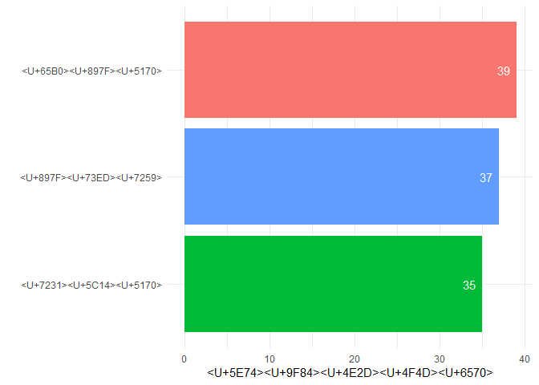
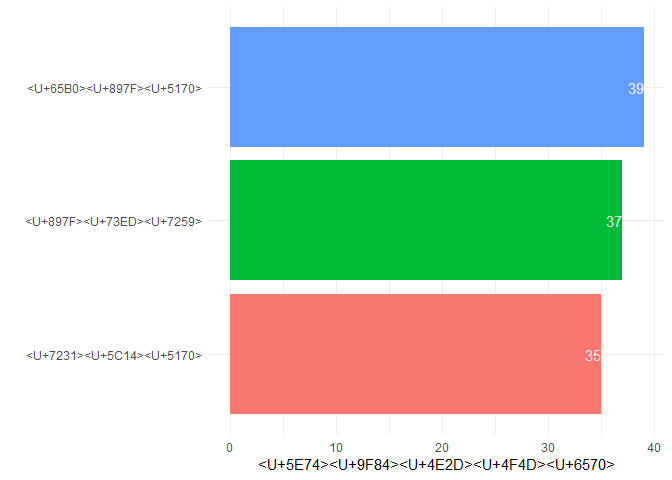
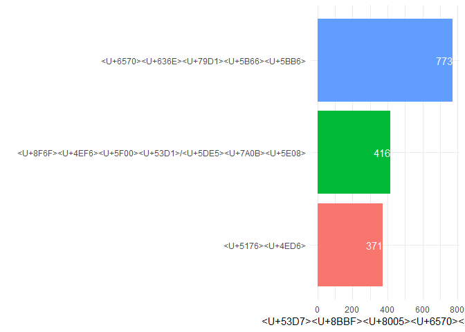
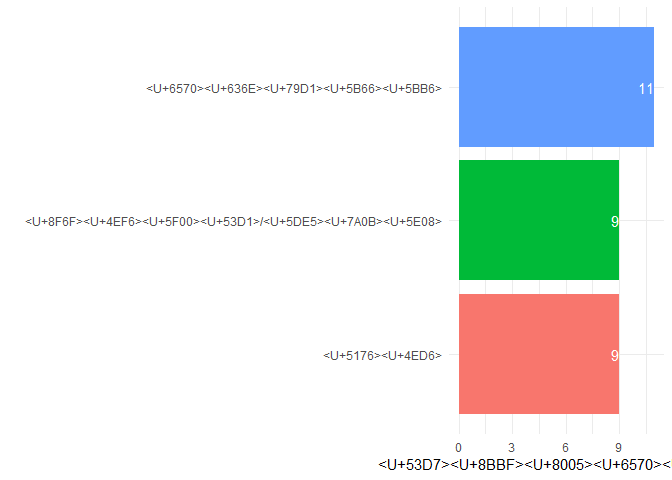
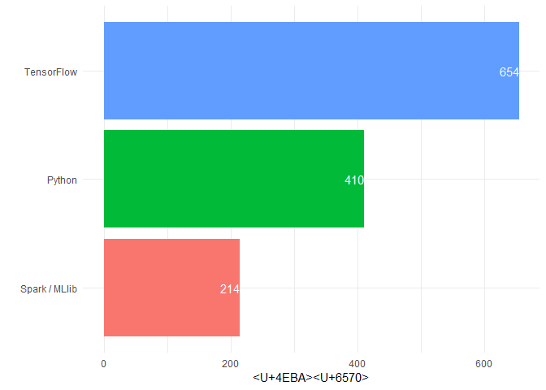
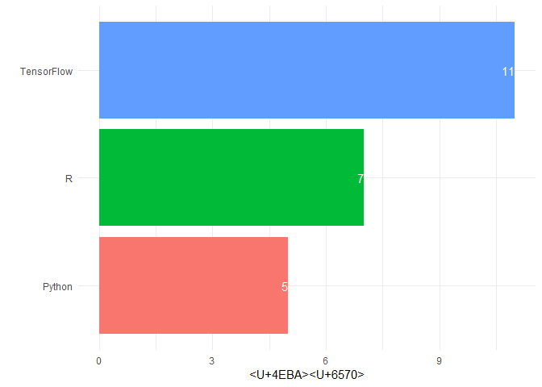
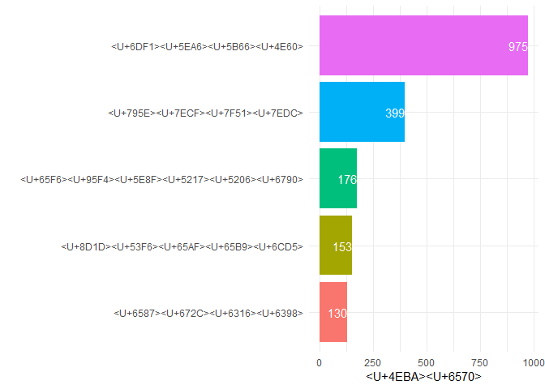
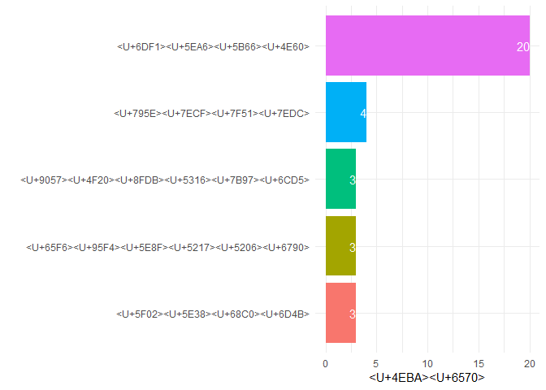

第7章
================
邬书豪 刘健

``` r
library(data.table) # fread()
library(tidyverse)    # ggplot()
```

``` r
responses <- fread("./multipleChoiceResponses")
dim(responses)
```

    ## [1] 15859   228

``` r
responses <- responses[,.(Age,Country,CurrentJobTitleSelect,MLToolNextYearSelect,MLMethodNextYearSelect,EmploymentStatus, FormalEducation,CoursePlatformSelect,FirstTrainingSelect,Tenure,JobSatisfaction,LanguageRecommendationSelect,JobSkillImportanceR,JobSkillImportancePython,JobSkillImportanceSQL,JobSkillImportanceBigData)]

dim(responses)
```

    ## [1] 15859    16

``` r
responses$Age %>% 
  unique()
```

    ##  [1]  NA  30  28  56  46  35  22  43  33  20  27  26  54  58  24  39  49
    ## [18]  25  21  51  34  41  32  53  29  36  23  48  37  63  40  31  59  38
    ## [35]  44  47  19  50  68  16  42  60  18   0  62  57  72  13  55  52  17
    ## [52]  15  69  11  70  65  45  14  64  80   6  61  66 100   1  10  67  73
    ## [69]  71  74  75   3  77  76  79  99  12   4   2  94  83  78   9  82  98

``` r
responses$Age%>% 
  grep("^1$", x = .)
```

    ## [1]  2049  4814 14125 15793

``` r
responses[Age!= 1][,1:2]
```

    ##        Age       Country
    ##     1:  30 United States
    ##     2:  28        Canada
    ##     3:  56 United States
    ##     4:  46        Brazil
    ##     5:  35 United States
    ##    ---                  
    ## 15533:  21     Indonesia
    ## 15534:  24         Other
    ## 15535:  25     Indonesia
    ## 15536:  16     Singapore
    ## 15537:  27         Japan

``` r
responses$Age <- ifelse(responses$Age %in% c(0:3, 100), 7, responses$Age)
responses[!is.na(Age)]$Age%>% 
  unique()
```

    ##  [1] 30 28 56 46 35 22 43 33 20 27 26 54 58 24 39 49 25 21 51 34 41 32 53
    ## [24] 29 36 23 48 37 63 40 31 59 38 44 47 19 50 68 16 42 60 18  7 62 57 72
    ## [47] 13 55 52 17 15 69 11 70 65 45 14 64 80  6 61 66 10 67 73 71 74 75 77
    ## [70] 76 79 99 12  4 94 83 78  9 82 98

``` r
df_country_age <- responses %>%
  group_by(Country) %>% 
  summarise(AgeMedian = median(Age, na.rm = T)) %>% 
  arrange(desc(AgeMedian)) 
df_country_age[1:10,]
```

    ## # A tibble: 10 x 2
    ##    Country     AgeMedian
    ##    <chr>           <dbl>
    ##  1 New Zealand        39
    ##  2 Spain              37
    ##  3 Ireland            35
    ##  4 Australia          34
    ##  5 Canada             34
    ##  6 Denmark            34
    ##  7 Israel             34
    ##  8 Italy              34
    ##  9 Netherlands        34
    ## 10 Norway             34

``` r
df_country_age <- responses[,.(AgeMedian  = median(Age, na.rm = TRUE)), by = .(Country)][order(AgeMedian,decreasing = TRUE)]
```

``` r
df_country_age <- df_country_age %>% 
  mutate(Country = ifelse(Country == "New Zealand", "新西兰", Country),
         Country = ifelse(Country == "Spain", "西班牙", 
                          ifelse(Country == "Ireland", "爱尔兰", Country))) 
df_country_age %>% 
  head(3) %>%
  ggplot(aes(x = reorder(Country, AgeMedian), y = AgeMedian,fill = Country)) +
  geom_bar(stat = 'identity') +
  labs(x = "", y = '年龄中位数') +
  geom_text(aes(label = AgeMedian), hjust = 1.5, colour = 'white') +
  coord_flip() +
  theme_minimal() +
  theme(legend.position = 'none') # 移除图例
```



``` r
df_country_age %>% 
  tail(3) %>%
  mutate(Country = case_when(Country == "Pakistan" ~ "巴基斯坦",
                             Country == "Indonesia" ~ "印度尼西亚",
                             Country == "Vietnam" ~ "越南")) %>% 
  ggplot(aes(x = reorder(Country, AgeMedian), y = AgeMedian,fill = Country)) +
  geom_bar(stat = 'identity') +
  labs(x = "", y = '年龄中位数') +
  geom_text(aes(label = AgeMedian), hjust = 1.5, colour = 'white') +
  coord_flip() +
  theme_minimal() +
  theme(legend.position = 'none') 
```


``` r
# 封装绘图函数
fun1 <- function(data, xlab, ylab, xname, yname) {
  ggplot(data, aes(xlab, ylab)) +
    geom_bar(aes(fill = xlab), stat = 'identity') +
    labs(x = "", y = yname) +
    geom_text(aes(label = ylab), hjust = 1, colour = 'white') +
    coord_flip() +
    theme_minimal() +
    theme(legend.position = 'none')
}
```

``` r
data <- head(df_country_age, 3)
xname <- ""
yname <- "年龄中位数"
fun1(data, reorder(data$Country, data$AgeMedian), data$AgeMedian, xname, yname)
```



``` r
df_CJT_USA <- responses %>% # 筛选CurrentJobTitleSelect不为空且美国kaggler的观测
  filter(CurrentJobTitleSelect != '' & Country == 'United States') %>% 
  group_by(CurrentJobTitleSelect) %>%
  summarise(Count = n()) %>%
  arrange(desc(Count)) %>% 
  mutate(CurrentJobTitleSelect = case_when(CurrentJobTitleSelect == "Data Scientist" ~ "数据科学家",
                                           CurrentJobTitleSelect == "Software Developer/Software Engineer" ~ "软件开发/工程师",
                                           CurrentJobTitleSelect == "Other" ~ "其他"))
df_CJT_USA$CurrentJobTitleSelect
```

    ##  [1] "<U+6570><U+636E><U+79D1><U+5B66><U+5BB6>"                 
    ##  [2] "<U+8F6F><U+4EF6><U+5F00><U+53D1>/<U+5DE5><U+7A0B><U+5E08>"
    ##  [3] "<U+5176><U+4ED6>"                                         
    ##  [4] NA                                                         
    ##  [5] NA                                                         
    ##  [6] NA                                                         
    ##  [7] NA                                                         
    ##  [8] NA                                                         
    ##  [9] NA                                                         
    ## [10] NA                                                         
    ## [11] NA                                                         
    ## [12] NA                                                         
    ## [13] NA                                                         
    ## [14] NA                                                         
    ## [15] NA                                                         
    ## [16] NA

``` r
data <- head(df_CJT_USA, 3)
xname <- ''
yname <- '受访者数量'
fun1(data, reorder(data$CurrentJobTitleSelect, data$Count), data$Count, xname, yname)
```



``` r
df_CJT_NZ <- responses %>%
  filter(CurrentJobTitleSelect != '' & Country == 'New Zealand') %>%
  group_by(CurrentJobTitleSelect) %>%
  summarise(Count = n()) %>%
  arrange(desc(Count)) %>% 
  mutate(CurrentJobTitleSelect = case_when(CurrentJobTitleSelect == "Data Scientist" ~ "数据科学家",
                                           CurrentJobTitleSelect == "Software Developer/Software Engineer" ~ "软件开发/工程师",
                                           CurrentJobTitleSelect == "Other" ~ "其他"))

data <- head(df_CJT_NZ, 3)
xname <- ''
yname <- '受访者数量'
fun1(data, reorder(data$CurrentJobTitleSelect, data$Count), data$Count, xname, yname)
```



``` r
df_MLT_USA <- responses %>% 
  filter(MLToolNextYearSelect != '' & Country == 'United States') %>%
  group_by(MLToolNextYearSelect) %>%
  summarise(Count = n()) %>%
  arrange(desc(Count)) 

data <- head(df_MLT_USA, 3)
xname <- '机器学习语言'
yname <- '人数'
fun1(data, reorder(data$MLToolNextYearSelect, data$Count), data$Count, xname, yname)
```



``` r
df_MLT_NZ <- responses %>% 
  filter(MLToolNextYearSelect != '' & Country == 'New Zealand') %>%
  group_by(MLToolNextYearSelect) %>%
  summarise(Count = n()) %>%
  arrange(desc(Count)) 

data <- head(df_MLT_NZ, 3)
xname <- '机器学习语言'
yname <- '人数'
fun1(data, reorder(data$MLToolNextYearSelect, data$Count), data$Count, xname, yname)
```



``` r
df_MLM_USA <- responses %>% 
  filter(MLMethodNextYearSelect != '' & Country == 'United States') %>% 
  group_by(MLMethodNextYearSelect) %>%
  summarise(Count = n()) %>% 
  arrange(desc(Count)) %>% 
  mutate(MLMethodNextYearSelect = case_when(MLMethodNextYearSelect == "Deep learning" ~ "深度学习",
                                           MLMethodNextYearSelect == "Neural Nets" ~ "神经网络",
                                           MLMethodNextYearSelect == "Time Series Analysis" ~ "时间序列分析",
                                           MLMethodNextYearSelect == "Bayesian Methods" ~ "贝叶斯方法",
                                           MLMethodNextYearSelect == "Text Mining" ~ "文本挖掘"))


data <- head(df_MLM_USA, 5)
xname <- '机器学习方法'
yname <- '人数'
fun1(data, reorder(data$MLMethodNextYearSelect, data$Count), data$Count, xname, yname)
```



``` r
df_MLM_NZ <- responses %>% 
  filter(MLMethodNextYearSelect != '' & Country == 'New Zealand') %>%
  group_by(MLMethodNextYearSelect) %>%
  summarise(Count = n()) %>%
  arrange(desc(Count)) %>% 
  mutate(MLMethodNextYearSelect = case_when(MLMethodNextYearSelect == "Deep learning" ~ "深度学习",
                                           MLMethodNextYearSelect == "Neural Nets" ~ "神经网络",
                                           MLMethodNextYearSelect == "Anomaly Detection" ~ "异常检测",
                                           MLMethodNextYearSelect == "Genetic & Evolutionary Algorithms" ~ "遗传进化算法",
                                           MLMethodNextYearSelect == "Time Series Analysis" ~ "时间序列分析"))


data <- head(df_MLM_NZ, 5)
xname <- '机器学习方法'
yname <- '人数'

fun1(data, reorder(data$MLMethodNextYearSelect, data$Count), data$Count, xname, yname)
```


