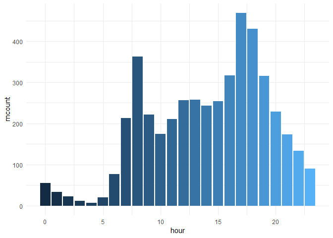
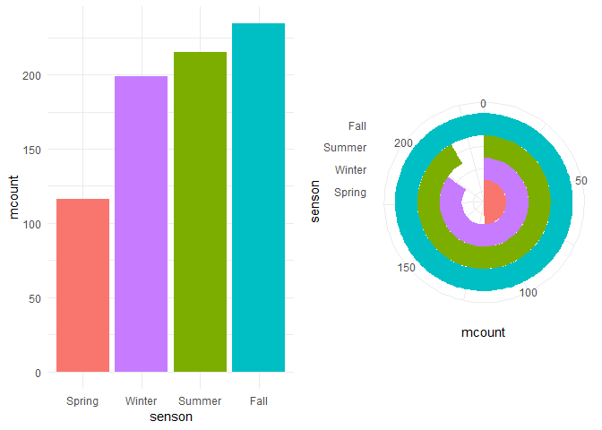
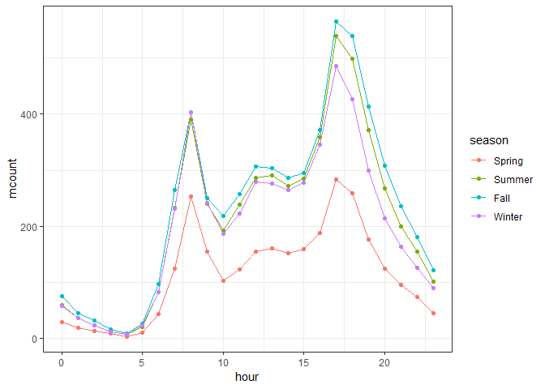
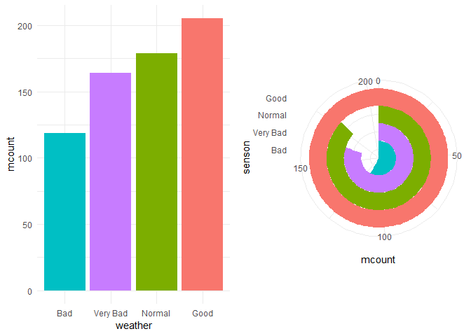
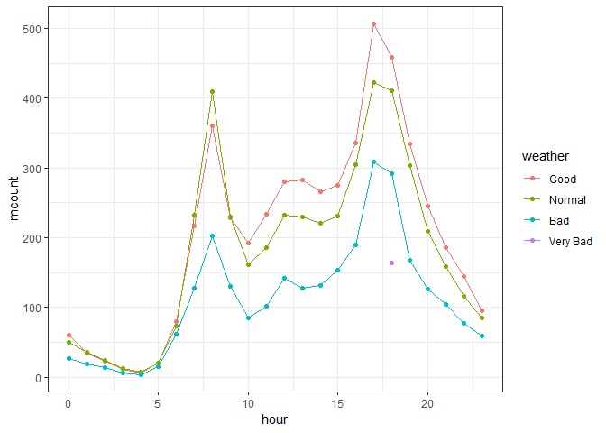
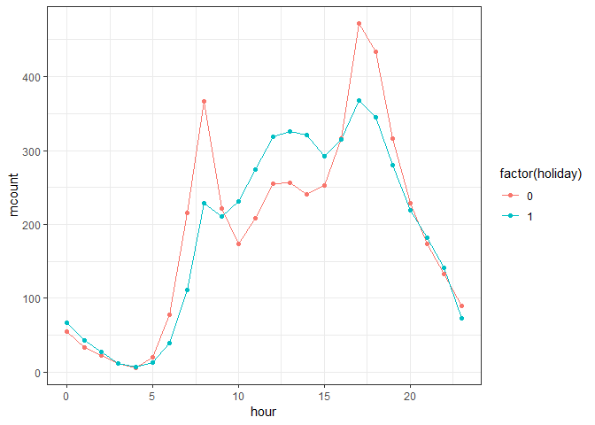
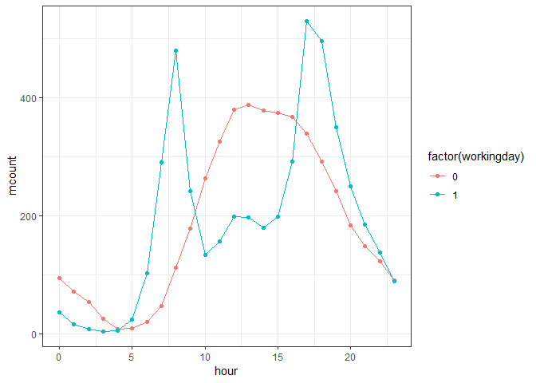
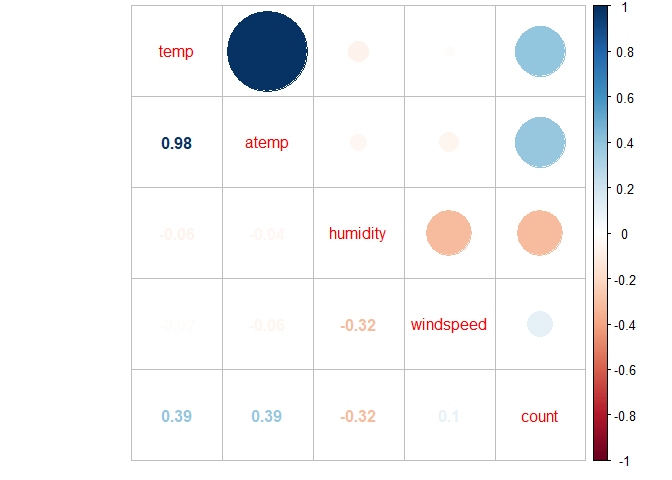

第8章
================
邬书豪 刘健

``` r
library(Rmisc)     # multiplot()
library(tidyverse)    # ggplot()
library(lubridate)   # ymd_hms()
library(data.table) 
library(corrplot)    # corrplot.mixed()
options(scipen = 20)  # 避免绘图时使用科学计数法表示某一个数值
```

``` r
bike <- fread("./train.csv")
```

``` r
str(bike)
```

    ## Classes 'data.table' and 'data.frame':   10886 obs. of  12 variables:
    ##  $ datetime  : chr  "2011/1/1 0:00" "2011/1/1 1:00" "2011/1/1 2:00" "2011/1/1 3:00" ...
    ##  $ season    : int  1 1 1 1 1 1 1 1 1 1 ...
    ##  $ holiday   : int  0 0 0 0 0 0 0 0 0 0 ...
    ##  $ workingday: int  0 0 0 0 0 0 0 0 0 0 ...
    ##  $ weather   : int  1 1 1 1 1 2 1 1 1 1 ...
    ##  $ temp      : num  9.84 9.02 9.02 9.84 9.84 ...
    ##  $ atemp     : num  14.4 13.6 13.6 14.4 14.4 ...
    ##  $ humidity  : int  81 80 80 75 75 75 80 86 75 76 ...
    ##  $ windspeed : num  0 0 0 0 0 ...
    ##  $ casual    : int  3 8 5 3 0 0 2 1 1 8 ...
    ##  $ registered: int  13 32 27 10 1 1 0 2 7 6 ...
    ##  $ count     : int  16 40 32 13 1 1 2 3 8 14 ...
    ##  - attr(*, ".internal.selfref")=<externalptr>

``` r
summary(bike)
```

    ##    datetime             season         holiday          workingday    
    ##  Length:10886       Min.   :1.000   Min.   :0.00000   Min.   :0.0000  
    ##  Class :character   1st Qu.:2.000   1st Qu.:0.00000   1st Qu.:0.0000  
    ##  Mode  :character   Median :3.000   Median :0.00000   Median :1.0000  
    ##                     Mean   :2.507   Mean   :0.02857   Mean   :0.6809  
    ##                     3rd Qu.:4.000   3rd Qu.:0.00000   3rd Qu.:1.0000  
    ##                     Max.   :4.000   Max.   :1.00000   Max.   :1.0000  
    ##     weather           temp           atemp          humidity     
    ##  Min.   :1.000   Min.   : 0.82   Min.   : 0.76   Min.   :  0.00  
    ##  1st Qu.:1.000   1st Qu.:13.94   1st Qu.:16.66   1st Qu.: 47.00  
    ##  Median :1.000   Median :20.50   Median :24.24   Median : 62.00  
    ##  Mean   :1.418   Mean   :20.23   Mean   :23.66   Mean   : 61.89  
    ##  3rd Qu.:2.000   3rd Qu.:26.24   3rd Qu.:31.06   3rd Qu.: 77.00  
    ##  Max.   :4.000   Max.   :41.00   Max.   :45.45   Max.   :100.00  
    ##    windspeed          casual         registered        count      
    ##  Min.   : 0.000   Min.   :  0.00   Min.   :  0.0   Min.   :  1.0  
    ##  1st Qu.: 7.002   1st Qu.:  4.00   1st Qu.: 36.0   1st Qu.: 42.0  
    ##  Median :12.998   Median : 17.00   Median :118.0   Median :145.0  
    ##  Mean   :12.799   Mean   : 36.02   Mean   :155.6   Mean   :191.6  
    ##  3rd Qu.:16.998   3rd Qu.: 49.00   3rd Qu.:222.0   3rd Qu.:284.0  
    ##  Max.   :56.997   Max.   :367.00   Max.   :886.0   Max.   :977.0

``` r
table(bike$season)   
```

    ## 
    ##    1    2    3    4 
    ## 2686 2733 2733 2734

``` r
table(bike$weather)   
```

    ## 
    ##    1    2    3    4 
    ## 7192 2834  859    1

``` r
bike$season <- factor(bike$season, labels = c("Spring", "Summer", "Fall", "Winter"))
bike$weather <- factor(bike$weather, labels = c("Good", "Normal", "Bad", "Very Bad"))

table(bike$season)
```

    ## 
    ## Spring Summer   Fall Winter 
    ##   2686   2733   2733   2734

``` r
table(bike$weather)
```

    ## 
    ##     Good   Normal      Bad Very Bad 
    ##     7192     2834      859        1

``` r
bike$hour <- lubridate::hour(ymd_hm(bike$datetime))
```

``` r
bike <- bike[,-c(10, 11)] 
head(bike)
```

    ##         datetime season holiday workingday weather temp  atemp humidity
    ## 1: 2011/1/1 0:00 Spring       0          0    Good 9.84 14.395       81
    ## 2: 2011/1/1 1:00 Spring       0          0    Good 9.02 13.635       80
    ## 3: 2011/1/1 2:00 Spring       0          0    Good 9.02 13.635       80
    ## 4: 2011/1/1 3:00 Spring       0          0    Good 9.84 14.395       75
    ## 5: 2011/1/1 4:00 Spring       0          0    Good 9.84 14.395       75
    ## 6: 2011/1/1 5:00 Spring       0          0  Normal 9.84 12.880       75
    ##    windspeed count hour
    ## 1:    0.0000    16    0
    ## 2:    0.0000    40    1
    ## 3:    0.0000    32    2
    ## 4:    0.0000    13    3
    ## 5:    0.0000     1    4
    ## 6:    6.0032     1    5

``` r
bike %>%
  group_by(hour) %>%
  summarise(mcount = mean(count)) %>%
  ggplot(aes(x = hour, y = mcount, fill = hour)) +
  geom_bar(stat = 'identity') +
  guides(fill = 'none') +
  theme_minimal()
```



``` r
p2 <- bike %>%
  group_by(season) %>%
  summarise(mcount = mean(count)) %>%
  ggplot(aes(x = reorder(season, mcount), y = mcount, fill = season)) +
  geom_bar(stat = 'identity') +
  labs(x = 'senson', y = 'mcount') +
  guides(fill = 'none') +
  theme_minimal()

p3 <- bike %>%
  group_by(season) %>%
  summarise(mcount = mean(count)) %>%
  ggplot(aes(x = reorder(season, mcount), y = mcount, fill = season)) +
  geom_bar(stat = 'identity', width = 1) +
  coord_polar(theta = "y") +
  labs(x = 'senson', y = 'mcount') +
  guides(fill = 'none') +
  theme_minimal()

multiplot(p2, p3, cols = 2)
```



``` r
bike %>%
  group_by(season, hour) %>%
  summarise(mcount = mean(count)) %>%
  ggplot(aes(x = hour, y = mcount, colour = season,group = season)) +
  geom_line() +
  theme_bw() +
  geom_point()
```



``` r
p5 <- bike %>%
  group_by(weather) %>%
  summarise(mcount = mean(count)) %>%
  ggplot(aes(x = reorder(weather, mcount), y = mcount, fill = weather)) +
  geom_bar(stat = 'identity') +
  labs(x = 'weather') +
  guides(fill = 'none') +
  theme_minimal()


p6 <- bike %>%
  group_by(weather) %>%
  summarise(mcount = mean(count)) %>%
  ggplot(aes(x = reorder(weather, mcount), y = mcount, fill = weather)) +
  geom_bar(stat = 'identity', width = 1) +
  coord_polar(theta = "y") +
  labs(x = 'senson', y = 'mcount') +
  guides(fill = 'none') +
  theme_minimal()

multiplot(p5, p6, cols = 2)
```



``` r
bike %>%
  group_by(weather, hour) %>%
  summarise(mcount = mean(count)) %>%
  ggplot(aes(x = hour, y = mcount, colour = weather)) +
  geom_line(aes(group = weather)) +
  theme_bw() +
  geom_point()
```



``` r
p8 <- bike %>%
  group_by(holiday) %>%
  summarise(mcount = mean(count)) %>%
  ggplot(aes(x = factor(holiday), y = mcount, fill = factor(holiday))) +
  geom_bar(stat = 'identity') +
  guides(fill = 'none') +
  labs(x = 'holiday') +
  theme_minimal()


# 探索是否工作日的平均租车频次
p9 <- bike %>%
  group_by(workingday) %>%
  summarise(mcount = mean(count)) %>%
  ggplot(aes(x = factor(workingday), y = mcount, fill = factor(workingday))) +
  geom_bar(stat = 'identity') +
  guides(fill = 'none') +
  labs(x = 'workingday') +
  theme_minimal()

multiplot(p8, p9, cols = 2)
```


``` r
bike %>%
  group_by(holiday, hour) %>%
  summarise(mcount = mean(count)) %>%
  ggplot(aes(x = hour, y = mcount, colour = factor(holiday))) +
  geom_line(aes(group = factor(holiday))) +
  geom_point() +
  theme_bw()
```



``` r
bike %>%
  group_by(workingday, hour) %>%
  summarise(mcount = mean(count)) %>%
  ggplot(aes(x = hour, y = mcount, colour = factor(workingday))) +
  geom_line(aes(group = factor(workingday))) +
  theme_bw() +
  geom_point()
```



``` r
cor(bike[,c(6:9, 10)]) %>%
  corrplot.mixed()
```


