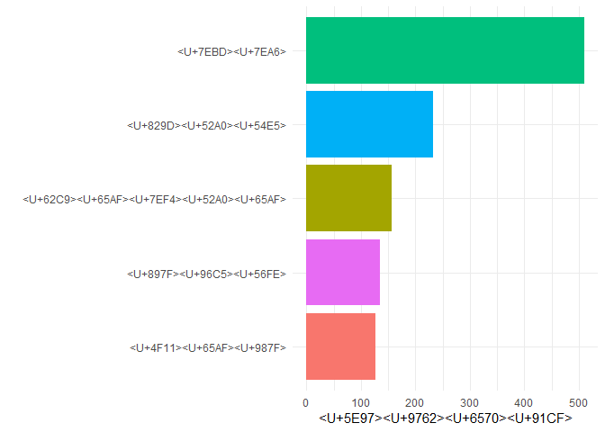
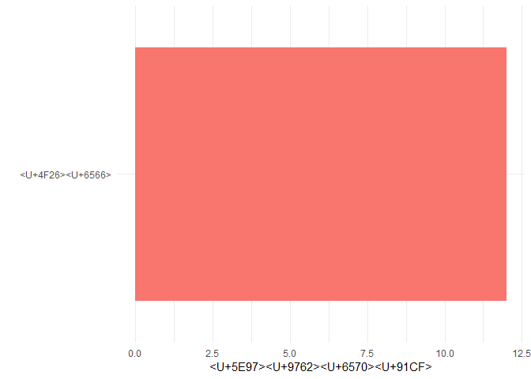

第9章
================
邬书豪 刘健

R Markdown
----------

``` r
## 加载程序包
library(dplyr)
```

    ## 
    ## Attaching package: 'dplyr'

    ## The following objects are masked from 'package:stats':
    ## 
    ##     filter, lag

    ## The following objects are masked from 'package:base':
    ## 
    ##     intersect, setdiff, setequal, union

``` r
library(data.table)
```

    ## 
    ## Attaching package: 'data.table'

    ## The following objects are masked from 'package:dplyr':
    ## 
    ##     between, first, last

``` r
library(countrycode)
library(plotly)
```

    ## Loading required package: ggplot2

    ## 
    ## Attaching package: 'plotly'

    ## The following object is masked from 'package:ggplot2':
    ## 
    ##     last_plot

    ## The following object is masked from 'package:stats':
    ## 
    ##     filter

    ## The following object is masked from 'package:graphics':
    ## 
    ##     layout

``` r
library(leaflet)
library(ggplot2)
## 读取数据
starbucks <- fread('./directory_changed.csv',encoding = "UTF-8")
str(starbucks)
```

    ## Classes 'data.table' and 'data.frame':   25206 obs. of  13 variables:
    ##  $ Brand         : chr  "Starbucks" "Starbucks" "Starbucks" "Starbucks" ...
    ##  $ Store Number  : chr  "47370-257954" "22331-212325" "47089-256771" "22126-218024" ...
    ##  $ Store Name    : chr  "Meritxell, 96" "Ajman Drive Thru" "Dana Mall" "Twofour 54" ...
    ##  $ Ownership Type: chr  "Licensed" "Licensed" "Licensed" "Licensed" ...
    ##  $ Street Address: chr  "Av. Meritxell, 96" "1 Street 69, Al Jarf" "Sheikh Khalifa Bin Zayed St." "Al Salam Street" ...
    ##  $ City          : chr  "Andorra la Vella" "Ajman" "Ajman" "Abu Dhabi" ...
    ##  $ State/Province: chr  "7" "AJ" "AJ" "AZ" ...
    ##  $ Country       : chr  "AD" "AE" "AE" "AE" ...
    ##  $ Postcode      : chr  "AD500" "" "" "" ...
    ##  $ Phone Number  : chr  "376818720" "" "" "" ...
    ##  $ Timezone      : chr  "GMT+1:00 Europe/Andorra" "GMT+04:00 Asia/Dubai" "GMT+04:00 Asia/Dubai" "GMT+04:00 Asia/Dubai" ...
    ##  $ Longitude     : num  1.53 55.47 55.47 54.38 54.54 ...
    ##  $ Latitude      : num  42.5 25.4 25.4 24.5 24.5 ...
    ##  - attr(*, ".internal.selfref")=<externalptr>

``` r
summary(starbucks)
```

    ##     Brand           Store Number        Store Name       
    ##  Length:25206       Length:25206       Length:25206      
    ##  Class :character   Class :character   Class :character  
    ##  Mode  :character   Mode  :character   Mode  :character  
    ##                                                          
    ##                                                          
    ##                                                          
    ##                                                          
    ##  Ownership Type     Street Address         City          
    ##  Length:25206       Length:25206       Length:25206      
    ##  Class :character   Class :character   Class :character  
    ##  Mode  :character   Mode  :character   Mode  :character  
    ##                                                          
    ##                                                          
    ##                                                          
    ##                                                          
    ##  State/Province       Country            Postcode        
    ##  Length:25206       Length:25206       Length:25206      
    ##  Class :character   Class :character   Class :character  
    ##  Mode  :character   Mode  :character   Mode  :character  
    ##                                                          
    ##                                                          
    ##                                                          
    ##                                                          
    ##  Phone Number         Timezone           Longitude          Latitude     
    ##  Length:25206       Length:25206       Min.   :-159.46   Min.   :-46.41  
    ##  Class :character   Class :character   1st Qu.:-104.84   1st Qu.: 31.54  
    ##  Mode  :character   Mode  :character   Median : -79.52   Median : 37.04  
    ##                                        Mean   : -30.20   Mean   : 34.95  
    ##                                        3rd Qu.:  77.10   3rd Qu.: 41.68  
    ##                                        Max.   : 176.92   Max.   : 64.85  
    ##                                        NA's   :1         NA's   :1

``` r
##简单清洗
names(starbucks)
```

    ##  [1] "Brand"          "Store Number"   "Store Name"     "Ownership Type"
    ##  [5] "Street Address" "City"           "State/Province" "Country"       
    ##  [9] "Postcode"       "Phone Number"   "Timezone"       "Longitude"     
    ## [13] "Latitude"

``` r
colnames(starbucks) <- make.names(colnames(starbucks))
names(starbucks)
```

    ##  [1] "Brand"          "Store.Number"   "Store.Name"     "Ownership.Type"
    ##  [5] "Street.Address" "City"           "State.Province" "Country"       
    ##  [9] "Postcode"       "Phone.Number"   "Timezone"       "Longitude"     
    ## [13] "Latitude"

``` r
## 统计各个各个国家中星巴克店铺的个数
sta_count <- 
  starbucks %>% 
  group_by(Country) %>% 
  summarise(Counts = n()) %>%
  arrange(desc(Counts))
## 统计每个国家店铺数量的占比
percent <- round(sta_count$Counts / sum(sta_count$Counts) * 100, 2)
sta_count <- transform(sta_count, Percent = paste0(percent, '%'))

## 对变量重命名，并且重塑一列（国家的全称）
data(codelist)
names(sta_count)[1] <- 'iso2'
sta_count$Country_name <- 
  codelist[match(sta_count$iso2, 
                 codelist$iso2c), "country.name.en"]
## 使用条形图去展示星巴克店铺数前二十的国家
# sta_count$iso2 <- factor(sta_count$iso2, levels = sta_count$iso2)
# plot_ly(data = sta_count[1:5, ],
#         type = 'bar', 
#         hoverinfo = 'text',
#         x = ~ iso2,
#         y = ~ Counts,
#         text = ~paste(iso2, " counts  : ", Counts, 
#                       " percent: ", Percent))
city_count <- 
  starbucks %>%
  group_by(City) %>%
  summarise(Counts = n()) %>%
  arrange(desc(Counts))
sta_us <- starbucks[Country == 'US', ]
sta_gb <- starbucks[starbucks$Country == 'GB', ]

# ggplot(city_count[1:5, ], 
#        aes(x = reorder(City, Counts), y = Counts, fill = City)) +
#   geom_bar(stat = 'identity') +
#   labs(x = 'City', y = 'Counts') +
#   theme_minimal() +
#   guides(fill = 'none') +
#   coord_flip()
## 统计美国的城市
top5_us <-  sta_us %>% 
  group_by(City) %>% 
  summarise(Counts = n()) %>%
  arrange(desc(Counts)) %>% 
  top_n(5)
```

    ## Selecting by Counts

``` r
city_names <- c("纽约", "芝加哥", "拉斯维加斯", "西雅图", "休斯顿")
rename <- setNames( city_names, top5_us$City)
top5_us$City <- rename[top5_us$City]

ggplot(top5_us, aes(x = reorder(City, Counts), y = Counts, fill = City)) +
  geom_bar(stat = 'identity') +
  labs(x = ' ', y = '店面数量') +
  theme_minimal() +
  guides(fill = 'none') +
  coord_flip()
```



``` r
## 统计英国的城市

top5_uk <-   sta_gb %>% 
  group_by(City) %>% 
  summarise(Counts = n()) %>%
  arrange(desc(Counts)) %>% 
  slice(5)
city_names <- c("伦敦", "曼彻斯特", "爱丁堡", "伯明翰", "格拉斯哥")
rename <- setNames( city_names, top5_uk$City)
top5_uk$City <- rename[top5_uk$City]

top5_uk %>% 
  ggplot(aes(x = reorder(City, Counts), y = Counts, fill = City)) +
  geom_bar(stat = 'identity') +
  labs(x = ' ', y = '店面数量') +
  theme_minimal() +
  guides(fill = 'none') +
  coord_flip()
```


